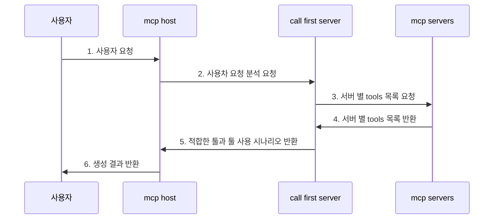
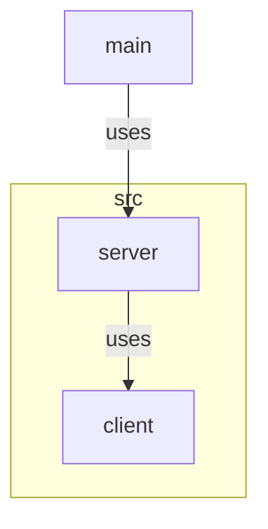

# MCP 실습

툴 컬링 시나리오 작성 서버 만들어보기

## 요약

**원인**
- claude desktop의 mcp 툴 컬링 정확도가 개인적인 체감으로 한 70% 정도라고 생각이 듦
- 툴 컬링의 정확도를 높여보자라는 생각. 

**가설(?)**
- mcp client를 통해 tool 리스트를 받아오면,
- mcp server안에 있는 gpt가 tool의 description과 이름을 읽고 적절한 tool 사용 시나리오를 작성해서 반환해 줄 것이다.
- mcp host가 해당 시나리오를 읽으면,
- mcp의 툴 컬링 정확도가 높아질 것이다.

**결과**

1. 단순하게 프롬프트 안에 tool list를 삽입하여 시나리오 생성 ❌

- 5~6개의 mcp 서버의 툴 리스트만 하더라도 수십개가 넘어가고 이는 매우 많은 토큰 수로 이어짐. 결과적으로 timeout이 계속해서 발생.
- timeout(=500)을 길게해도 timeout 상황이 발생
- 결론적으로, 한 번의 요청에 500초 씩 써야하는 상황은 애초에 사용불가...

2. llm에 tool 리스트를 등록한 후에 툴 목록을 읽고 시나리오 생성 ❌

- 생성 시 자신의 툴 인식을 못함.
- 결론적으로 툴 리스트를 등록한 후에 프롬프트를 통해, 툴 사용 시나리오 생성에는 활용 불가

## 결론

- 단순하게 프롬프트나 tool을 바인딩해서 시나리오를 생성하는 방식은 불가...
- 아마도 tool calling이 필요한 경우 API 내부적으로는 RAG를 사용하는게 아닌가 하는 생각이 듦...
- 나중에 tool calling 시나리오를 작성해서 반환해보는 걸 할 때, rag를 한번 붙여봐도 되지 않을까 하는 생각...
- 현재는 mcp client를 사용해서 mcp 서버를 다른 llm과 한 번 섞어 써 본 것에 만족!

## 간단한 설계

**시퀀스 다이어그램**

